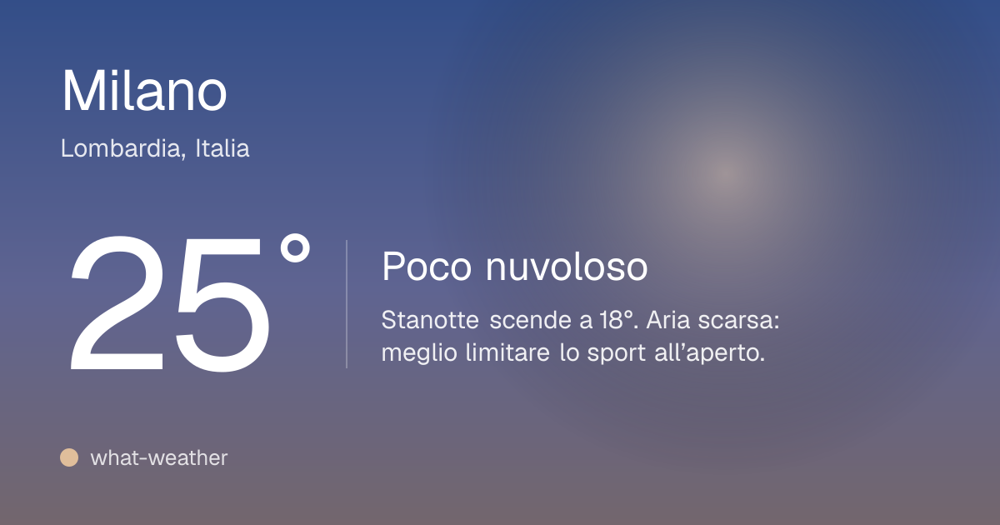
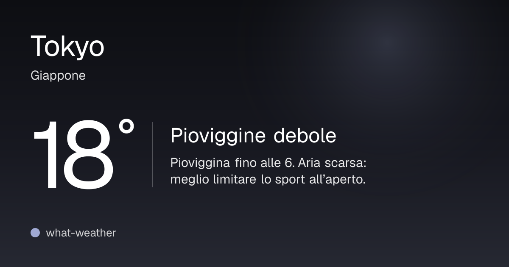
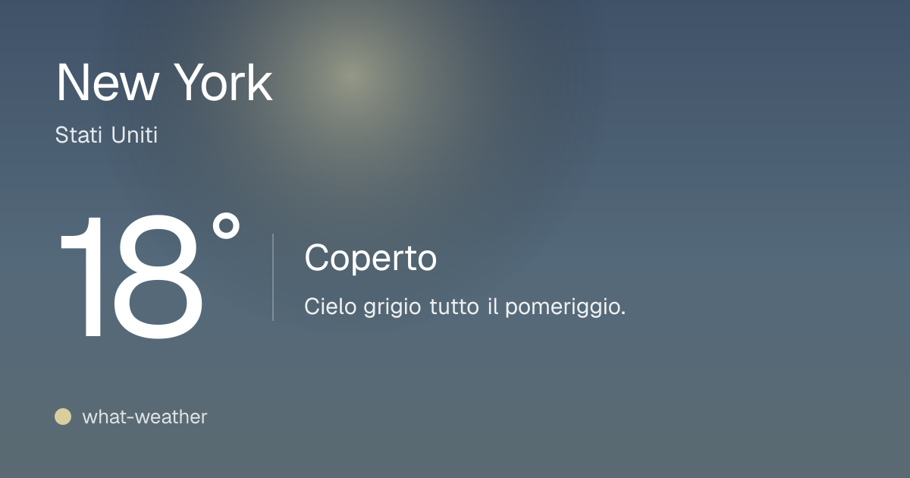
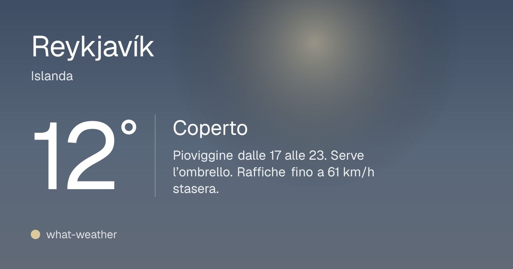

# what-weather

**Weather, calmly: the right information at the right moment.**

**Try it live: [what-weather-theta.vercel.app](https://what-weather-theta.vercel.app)**

what-weather (say it like "whatever") is a weather web app that reads like a Swiss typographic poster. It sets the place's name large and heavy, puts the temperature beside it, and adds a few facts in small print. Behind the text is the sky of the moment and a map of the city. Scroll down for the hours ahead, the week and the details. The interface is in Italian.

| | |
| --- | --- |
|  |  |
|  |  |

These are the share previews the site draws for each place, taken from the live app: the sky of the moment, the temperature and the outlook in words. Open the [live site](https://what-weather-theta.vercel.app) for the full page, with the map, the timeline and the week.

## Features

- **The poster.** A six-column grid, flush left, with three text sizes and hairlines for structure. It stays pinned on the left on a computer and fills the first screen on a phone.
- **A live sky.** The background colours follow the time of day and the weather, and cross-fade as you scrub through the hours.
- **The city behind the page.** A Mapbox map of the place sits centred behind the poster and zooms into the streets as you scroll.
- **The next 24 hours.** A timeline you can drag to explore: the whole page follows the hour you pick.
- **The week.** Daily ranges drawn on a temperature colour scale; pick a day to explore it.
- **Rain map.** Clouds and precipitation over the next 12 hours, played as an animation.
- **Details.** Air quality, UV, wind, humidity, sun and moon, and alerts. The urgent ones move up to the top.
- **Outlook in words.** A short, plain sentence about what the weather will do next.
- **Places.** Search any city, save your favourites and switch between them in one tap. Once you scroll, the search folds into a round button at the bottom right, so a new city is always one tap away. The last place you viewed opens next time.
- **Sharing.** Every place has its own URL and a generated preview image. It also installs as a web app.

## Tech stack

- [Next.js 16](https://nextjs.org) (App Router, Cache Components) and React 19
- Tailwind CSS 4
- Mapbox GL JS for the maps
- Vitest for the tests
- Weather from [OpenWeather](https://openweathermap.org) or [Open-Meteo](https://open-meteo.com), or built-in sample data

## Getting started

You need Node.js 22 or later.

```bash
git clone https://github.com/simo-sciuto/what-weather.git
cd what-weather
npm install
cp .env.example .env.local
npm run dev
```

Open [http://localhost:3000](http://localhost:3000).

With no keys set, the app runs on sample data, so it works straight away. Add keys to `.env.local` to see real weather.

## Configuration

Set these in `.env.local`. They are all optional.

| Variable | What it does |
| --- | --- |
| `OPENWEATHER_API_KEY` | OpenWeather key. It is used for the forecast and to name places found by search or location. |
| `WEATHER_PROVIDER` | `openweather` (One Call 4.0, paid plan), `openweather-free` (free tier), `open-meteo` (free for non-commercial use, no key) or `mock` (sample data). The default is `openweather` when a key is set and `mock` otherwise. |
| `NEXT_PUBLIC_MAPBOX_TOKEN` | Mapbox public token (`pk.…`). Without it the app shows no maps. Restrict the token to your domains in your Mapbox account. |
| `SITE_URL` | The public address of the site, used for absolute share-image URLs. On Vercel the deployment URL is used by default. |

## Sample data

The sample provider has ready-made scenarios for designing and testing: `clear`, `partly-cloudy`, `cloudy`, `rain-soon`, `heavy-rain`, `storm`, `snow`, `fog`, `windy` and `smog`. Pick one in the URL and, if you want, the time of day:

```
http://localhost:3000/?mock=storm&at=21:30
```

Links to every scenario also appear at the foot of the page when sample data is on.

## Scripts

| Command | What it does |
| --- | --- |
| `npm run dev` | Start the development server |
| `npm run build` | Build for production |
| `npm start` | Serve the production build |
| `npm run lint` | Run ESLint |
| `npm test` | Run the tests once |
| `npm run test:watch` | Run the tests in watch mode |

## Project structure

```
src/
  app/                  Routes, layout, loading and error states, web manifest
    api/                Place search, saved-place summaries, the map's cloud grid, share images
  components/
    location/           Search, saved places, the current place
    time/               The timeline and everything that follows the hour on show
    weather/            The poster, the chapters, the maps, icons and figures
  lib/
    weather/            Providers, formatting, palettes, the outlook sentence, tests
```

## Credits

Weather, air quality and place search come from [OpenWeather](https://openweathermap.org) or [Open-Meteo.com](https://open-meteo.com) (CC BY 4.0), depending on `WEATHER_PROVIDER`. With Open-Meteo, OpenWeather names a place found by location when a key is set. The clouds and rain on the maps always come from Open-Meteo. Maps are © [Mapbox](https://www.mapbox.com/about/maps/) and © [OpenStreetMap](https://www.openstreetmap.org/copyright) contributors. The page's footer lists the sources actually in use.
